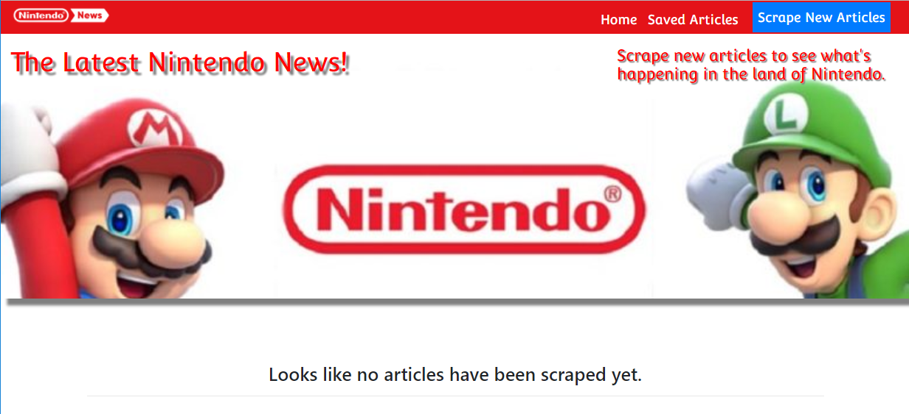
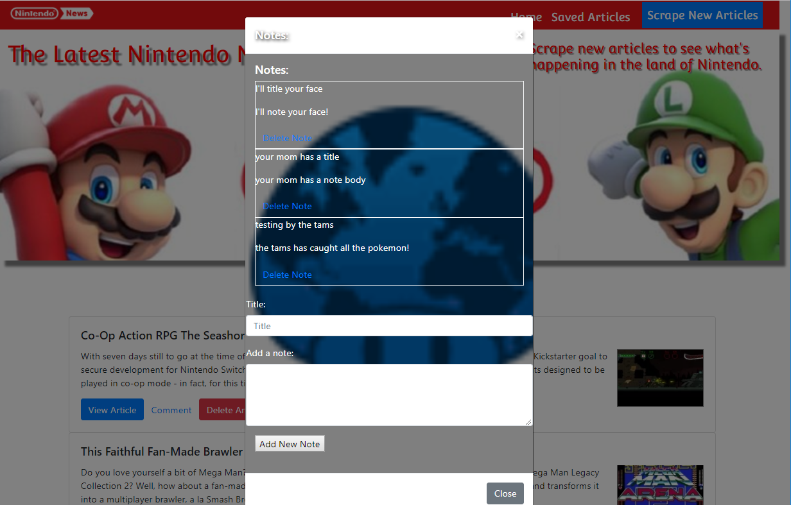

# Mongo-Scrape / Nintendonews
scraping with mongo and mongoose

### Overview

This app lets you scrape news stories about nintendo, view, save and comment on them. I've used Mongodb, Node, mongoose, cheerio, Express and other technologies.

-----------------------------------------
#### March 2018 

-----------------------------------------

Current Version 1.0

---

* Nintendonews lets you scrape http://www.nintendolife.com/news/ using cheerio for current stories.

* You can view the most recent stories or save them for later.

* You can comment on saved stories.  Comments will be saved for each individual story you save.

* [Check out this web site to see it in action!](https://nintendonews.herokuapp.com/.

---

## Screenshots

<table>
    <tr>
        <td>
            
        </td>
        <td>
            
        </td>
    </tr>
</table>

## How you can help

* Please let us know if you find any errors or if you have ways to achieve better efficiency.

-----------------------------------------

### How does the app work?

1. The app uses the express node app to serve the pages.

2. The routing is done in javascript using the express module, and data is pulled from the news site via cheerio.

3. The app is hosted on heroku.

3. Data is stored and pulled from a mongodb using mongoose.

## Dependencies
    
    "axios": "^0.16.2",
    "body-parser": "^1.18.2",
    "cheerio": "^1.0.0-rc.2",
    "express": "^4.16.1",
    "mongoose": "^4.12.0",
    "morgan": "^1.9.0"

## History

This project was created as a homework assignment on 03-10-18 for the University of Richmond Programming Bootcamp.

## License

This project is in the public domain within the United States, and
copyright and related rights in the work worldwide are waived through
the [CC0 1.0 Universal public domain dedication](https://creativecommons.org/publicdomain/zero/1.0/).# group2-project2